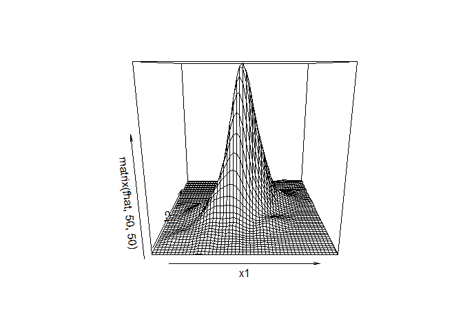
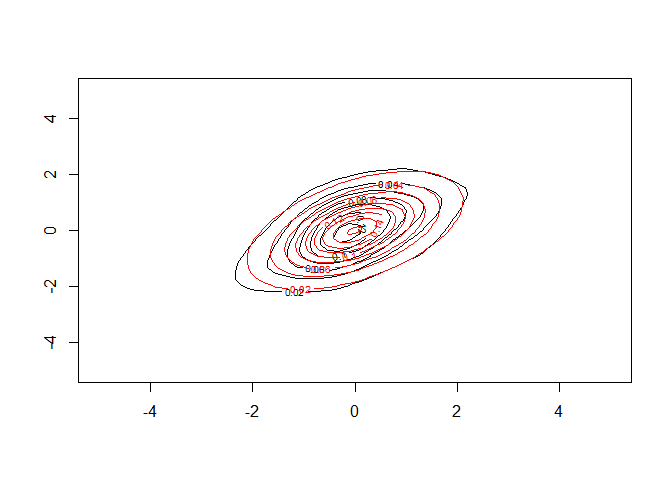

<!-- README.md is generated from README.Rmd. Please edit that file -->

# rlcv

<!-- badges: start -->
<!-- badges: end -->

The goal of rlcv is to provide a robust likelihood cross validation
bandwidth selector for kernel density estimation. It allows for both
uni-variate and multi-variate densities. It is resistant against
fat-tailed distributions and outliers.

## Installation

You can install the development version of rlcv like so:

``` r
install.packages('rlcv')
```

## Example

This is a basic example which shows you how to use `rlcv` to fit a
fat-tailed bivariate distribution:

``` r
library(rlcv)
## basic example code
# fat-tailed marginals + fat-tailed copula
library(copula)
ncop=tCopula(.5,df=5)
n=500
u=rCopula(n,ncop)
x1=qt(u[,1],5)
x2=qt(u[,2],5)
x=cbind(x1,x2)
fit=rlcv_d(x.obs=x)
# evaluation data
x1=x2=seq(-5,5,length=50)
x11=rep(x1,each=50)
x22=rep(x2,50)
fhat=kde_d(x.new=cbind(x11,x22),x.obs=x,,h=fit$h)
f0=dCopula(cbind(pt(x11,5),pt(x22,5)),ncop)*dt(x11,5)*dt(x22,5)
# Mean squared errors
mean((f0-fhat)^2)
#> [1] 2.131485e-05

persp(x1,x2,matrix(fhat,50,50))
```



``` r
contour(x1,x2,matrix(fhat,50,50))
contour(x1,x2,matrix(f0,50,50),add=TRUE,col='red')
```


